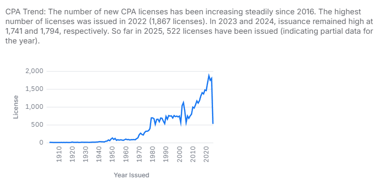

## Washington State Certified Public Accountants

## Overview
This dataset comprises records of Certified Public Accountants (CPAs) in Washington State, detailing their licensing information, personal identifiers, and geographic locations. It contains 47,922 entries, each representing an individual CPA with attributes such as first name, last name, middle name, suffix, preferred name, city, state, and country. Additionally, the dataset includes license-specific details such as license number, original issue date, expiration date, and status. Some records also contain board orders and other administrative annotations.

<table>
<tr>
<td></td>
<td></td>
</tr>
<table>

The dataset presents a comprehensive view of CPA licensing trends across different regions, allowing for insights into license validity, geographical distribution, and professional status. While most records contain essential details, some fields have missing values, particularly in the middle name, state, and preferred name columns. This data set includes CPA licensed data from 1903 to 2025.

## Motivation Statement

The motivation behind analyzing this dataset is to gain insights into CPA licensing patterns, track active and lapsed licenses, and understand the geographical distribution of licensed professionals. By examining trends in licensing dates and statuses, stakeholders can identify regulatory compliance patterns, renewal frequencies, and potential areas of professional shortages or surpluses.

This dataset can serve as a valuable resource for regulatory boards, professional associations, and researchers interested in workforce analytics, credential verification, and the broader impact of licensing regulations on the accounting profession. Understanding these patterns can help improve policy decisions, streamline licensing processes, and ensure better oversight of CPA professionals.

## Repository Contents

- **📊 Dataset**:
  - 🗂️ `cpa.csv`: A dataset of Certified Public Accountants in the state of Washington.
  
- **📄 Analysis Scripts**:
  - 📄 `cpa.malloy`: Has all the sources used in this repository and views that can be used to filter for querying. 
  - 📝 `CPA Views Quick Look.malloynb`: Views of the dataset to utilize for quick analysis.
  - 🏦 `CPA Overview.malloynb`: Dashboard of metrics and graphs for an executive view.

## How to Open a Shared GitHub File and Run Malloy Code
Click on the (https://github.com/darrenowsley/Washington-Certified-Public-Accountants.git) provided to access the shared repository or file. 

Once on Github, click Shift + period this will load the web editor. Then install the malloy extension. See images below for reference:
| **Step**   | **Image Preview** |
|--------|-----------|
| `Step 1 - Press allow` |  |
| `Step 2 - Click the Blocks, search for Malloy, install` |  |
| `Step 3 - Click Trust` |  |
| `Step 4 - Click a .malloynb file` |  |
| `Step 5 - Press Run` |  |

## Dataset Information
- **Source:** Washington State CPA Licensing Board
- **Date of Extraction:** February 27, 2025
- **File Format:** CSV
- **Total Records:** 47,922
- **Columns:**

  | Column Name          | Description |
  |----------------------|-------------|
  | First Name          | First name of the CPA |
  | Middle Name         | Middle name of the CPA (if available) |
  | Last Name           | Last name of the CPA |
  | Suffix              | Suffix (e.g., Jr., Sr.) |
  | Preferred Name      | Preferred name, if provided |
  | City               | City of residence or practice |
  | State              | U.S. state of residence/practice |
  | Country            | Country of residence/practice |
  | License Number     | Unique CPA license identifier |
  | Original Issue Date | Date the CPA license was first issued |
  | Expiration Date    | Date the license is set to expire |
  | Status            | Current license status (Active, Lapsed, Expired) |
  | Last Updated      | Last recorded update (empty in this dataset) |
  | Board Order       | Disciplinary board order (if applicable) |

## Potential Use Cases
- **Regulatory Compliance**: Identifying active and expired licenses.
- **Geographic Analysis**: Understanding CPA distribution across regions.
- **License Trends**: Analyzing issuance and expiration trends over time.
- **Demographic Insights**: Common names and regional concentrations.

## Questions for Analysis
1. What percentage of CPAs have an active license?
2. How many CPAs have licenses that have expired or lapsed?
3. What is the distribution of CPAs across different states and countries?
4. Which cities have the highest concentration of CPAs?
5. What is the average duration between the license issue and expiration dates?
6. How many CPAs have disciplinary board orders?
7. What is the average duration of a CPA license compared to the average duration of a suspended or revoked license.

<table>
<tr>
<td></td>
<td></td>
<td></td>
</tr>
<table>

## License & Disclaimer
This dataset is for informational purposes only. It may not reflect real-time updates and should not be used for official verification. Please refer to the official Washington State CPA Licensing Board for the most up-to-date information. The files provided directly via data.wa.gov are, as government documents, now in the public domain. All other files have been generated by Darren Owsley for Gonzaga University Graduate School of Business as part of the MSBA-622-01 Data Science for Business (Spring 2025) course. This repository’s code is available under the MIT License terms.
